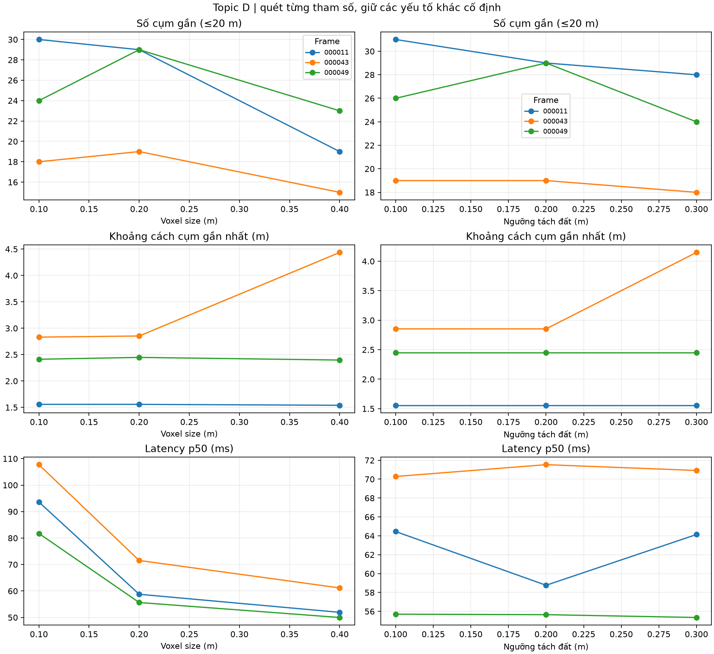
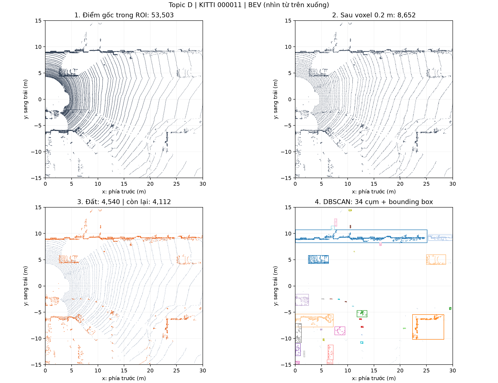
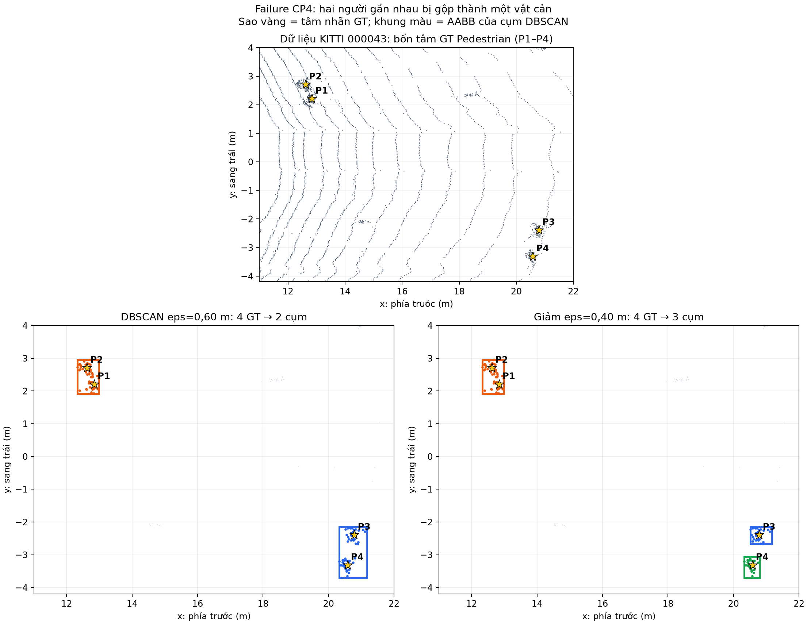

# Báo cáo Day 6: Ảnh hưởng của voxel downsample và ngưỡng tách mặt đất đến phát hiện vật cản gần bằng LiDAR

> Thay **mọi** ô có chữ ĐIỀN nằm trong ngoặc vuông bằng nội dung của bạn, xoá luôn cả dấu ngoặc vuông. Lệnh `python tools/check_submission.py` sẽ báo FAIL nếu còn sót bất kỳ chỗ nào.

- **Họ tên:** Phan Trọng Hoàn
- **MSSV:** 2A202602954
- **Lớp:** Track 4
- **Link repo:** https://github.com/naoh-pt/PhanTrongHoan-2A202602954-Track4-Day21
- **Topic:** D — Robot/drone obstacle
- **Dataset:** `data/kitti_mini` (thí nghiệm chính); `data/synthetic` (kiểm tra pipeline)
- **Các frame chọn cho thí nghiệm:** `000011`, `000043`, `000049`

> Hãy viết ngắn: mỗi mục từ 3 đến 8 dòng, ưu tiên số liệu và hình ảnh.

## 1. Claim

Một câu khẳng định kỹ thuật có thể kiểm chứng. Ví dụ: *"Lệch yaw 1° làm 12% điểm LiDAR rơi ra khỏi vật thể ở 30 m, phát hiện được bằng edge-alignment score với ngưỡng X."*

Trên ba frame KITTI `000011`, `000043`, `000049`, trong ROI phía trước 0–30 m, tăng `voxel_size` từ 0,10 lên 0,40 m làm giảm ít nhất 20% **tổng số cụm gần** (AABB cách LiDAR ≤20 m), khi giữ ngưỡng tách đất 0,20 m, DBSCAN `eps=0,60 m`, `min_points=8` và seed 0. Kết quả CP3 là 72 → 57 cụm, giảm 20,8% khi cộng ba frame; mức giảm không đúng 20% trên từng frame.

## 2. Evidence

Quét riêng voxel 0,10/0,20/0,40 m và ngưỡng RANSAC 0,10/0,20/0,30 m. Bảng dưới là frame `000043`; toàn bộ 15 cấu hình nằm trong [CSV kết quả](../results/obstacle_parameter_sweep.csv) và [300 lần đo latency](../results/obstacle_latency.csv).

| Voxel / ngưỡng đất (m) | Cụm / cụm gần | Chiều cao box trung vị (m) | Cụm gần nhất (m) | p50 / p95 (ms) |
|---|---:|---:|---:|---:|
| 0,10 / 0,20 | 30 / 18 | 0,731 | 2,832 | 107,7 / 127,5 |
| 0,20 / 0,20 | 26 / 19 | 0,708 | 2,853 | 71,5 / 79,2 |
| 0,40 / 0,20 | 18 / 15 | 1,538 | 4,436 | 61,2 / 76,9 |
| 0,20 / 0,10 | 24 / 19 | 0,823 | 2,853 | 70,3 / 79,9 |
| 0,20 / 0,30 | 22 / 18 | 0,857 | 4,149 | 70,9 / 88,4 |



Vùng quan tâm và DBSCAN được giữ cố định, seed 0; mỗi cấu hình bỏ lần chạy đầu rồi đo 20 lần trên CPU Intel i5-1035G1, Open3D 0.20.0. Latency gồm voxel, RANSAC, DBSCAN và tạo box, không gồm đọc file/vùng quan tâm. Kết quả hình học trùng khớp khi chạy lại; latency có dao động. Số cụm là chỉ số của pipeline, chưa phải recall theo nhãn GT.

Demo CP2 trên KITTI `000011`: 53.503 điểm trong vùng quan tâm, còn 8.652 điểm sau voxel 0,20 m; RANSAC tách 4.540 điểm mặt đất và DBSCAN tạo 34 cụm. Đây là kiểm tra pipeline, chưa phải kết quả benchmark CP3.



## 3. Failure case

KITTI `000043` có 4 nhãn `Pedestrian`: P1/P2 ở khoảng 12–13 m, P3/P4 ở khoảng 20–21 m. Với voxel 0,20 m, ngưỡng đất 0,20 m và DBSCAN `eps=0,60 m`, tâm hai người trong mỗi cặp nằm chung một AABB cụm: **4 GT → 2 cụm**. Một cụm vì thế không đại diện cho một người.



Nguyên nhân chính thuộc **Preprocess**: `eps` nối các điểm của hai người đứng gần nhau thành một cụm; lớp **Metric** cũng cần lưu ý vì đếm cụm không phải đếm người hay recall theo GT. Giữ mọi tham số khác và giảm `eps` xuống 0,40 m chỉ cải thiện thành **4 GT → 3 cụm**; P1/P2 vẫn bị gộp. Khi chạy trên robot, cần theo dõi cụm rộng bất thường, thử ngưỡng theo mật độ/khoảng cách và đối chiếu theo thời gian hoặc với cảm biến khác trước khi coi mỗi cụm là một vật cản riêng.

## 4. Khuyến nghị nếu triển khai thật

Use-case cụ thể (ADAS / robot / drone), trade-off và bước tiếp theo.

[ĐIỀN]

## 5. Cách chạy lại

Từ gốc repo trên Windows PowerShell, chạy các lệnh sau để tái tạo demo CP2, benchmark CP3 và failure case CP4.

```powershell
python -m venv .venv
.\.venv\Scripts\python.exe -m pip install -r requirements.txt
.\.venv\Scripts\python.exe -m pip install "open3d>=0.18"
.\.venv\Scripts\python.exe -m src.obstacle_demo --data-root data/kitti_mini --frame 000011 --voxel-size 0.20 --ground-threshold 0.20 --eps 0.60 --min-points 8 --seed 0 --out results/figures/obstacle_demo_000011.png
.\.venv\Scripts\python.exe -m src.obstacle_benchmark
.\.venv\Scripts\python.exe -m src.obstacle_failure --data-root data/kitti_mini --frame 000043 --out results/figures/fail_01_merged_pedestrians.png
```

## 6. Khai báo sử dụng AI

Ghi rõ đã dùng công cụ AI nào, dùng vào việc gì, và bạn đã tự kiểm chứng kết quả đó bằng cách nào. Nếu không dùng AI, ghi "Không sử dụng". Xem quy định ở `RULES.md` mục 2.

| Công cụ | Dùng cho việc gì | Bạn đã kiểm chứng thế nào |
|---|---|---|
| OpenAI Codex | Hỗ trợ xây dựng script CP2–CP4, chạy thí nghiệm và rà soát báo cáo | Đã chạy demo KITTI/synthetic, kiểm tra 15 cấu hình, chạy lại metric hình học và đối chiếu 4 nhãn Pedestrian với ảnh failure; học viên cần tự chạy và giải thích lại trước khi nộp |
